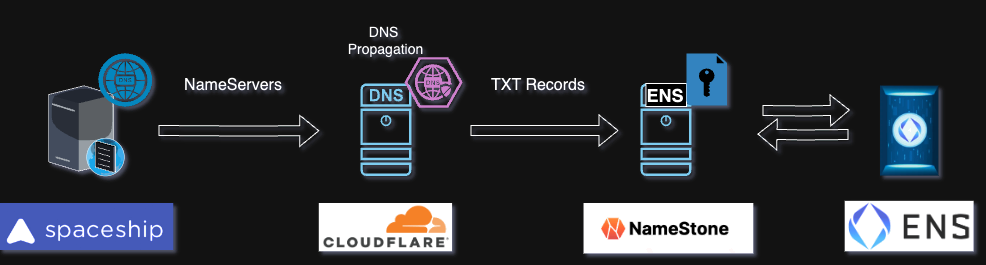

# Infrastracture

This doc explains our platform infrastracture and technology choices.

## ENS

We will explain why and how we integrated ENS with our Platform.

### MICE with ENS
#### Why do we need to integrate ENS with MICE?

Our solution has 2 User Roles; Company and Hacker.

In order for the Hacker to audit the company, they need to know the identity of the Company they are auditing. ENS is a perfect solution for that, as we simply create for each company we create: `company.mice.sh` ENS.

### ENS Architecture

## Security
Coming soon

## Automation
Coming soon

## Scalability
Coming soon

## Monitoring
Coming soon
